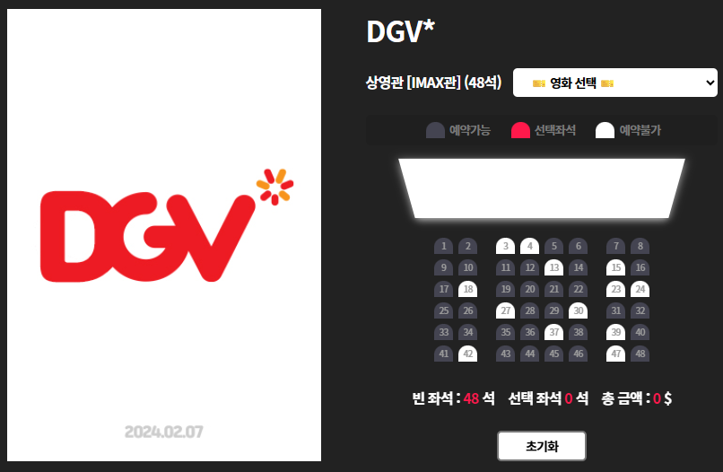
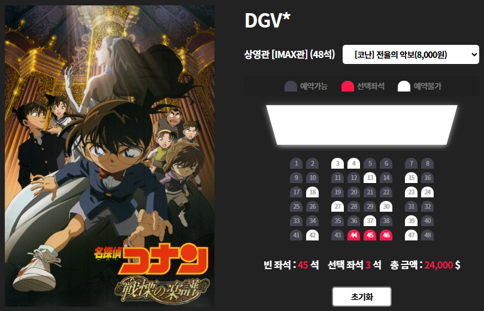
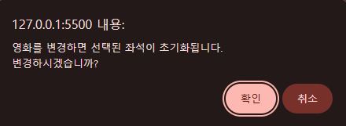

### ⭐ Movie Seat Booking (영화 좌석 예매 시스템)
<br>

### 소개 (Overview)

> HTML · CSS · JavaScript 로 구현한 영화 좌석 예매 시뮬레이터입니다.
LocalStorage를 활용한 상태 저장, 영화 변경 시 좌석 초기화,
금액 계산, 좌석 선택 UI 등을 통해 UI/UX 개선과 DOM 이벤트 처리 경험을 쌓기 위한 프로젝트입니다.
<Br>


### ⚙️ 주요 기능 (Features)

- 좌석 선택 / 취소 기능
- 영화 변경 시 좌석 초기화 + 경고창 표시
- 선택된 좌석 수 & 총 금액 실시간 계산
- LocalStorage 기반 데이터 저장
- 영화 포스터 이미지 동적 변경
- 초기화 버튼을 통한 전체 상태 Reset
<Br>

### ⚙️ 기술 스택 (Tech Stack)
| 구분       | 사용 기술                 |
| -------- | --------------------- |
| Frontend | HTML, CSS, JavaScript |
| Backend  | 없음 (프론트 전용 프로젝트)      |
| Tools    | Git, GitHub           |
| Infra    | -                     |
<Br>

### 📂 프로젝트 구조 (Project Structure)
```bash
/movie-seat-booking
 ├── client/
 │     ├── public/
 │     │     └── index.html
 │     ├── src/
 │     │     ├── css/style.css
 │     │     ├── js/script.js
 │     │     └── components/ (optional)
 │     └── README.md
 │
 ├── docs/
 │     ├── screenshots/
 │     ├── erd.png
 │     └── api-spec.md
 │
 ├── server/        # (향후 백엔드 확장 시 사용)
 │     └── springboot/ or node/
 │
 ├── .gitignore
 └── README.md
```
<br>

### 🗄 핵심 로직 (Core Logic)
### 1. UI 초기화 & LocalStorage 연동
- LocalStorage에 저장된 좌석 목록 복원
- 영화 선택은 항상 기본값으로 초기화
- 포스터도 기본 이미지로 초기화

```javascript
const populateUI = () => {
  const selectedSeats = JSON.parse(localStorage.getItem("selectedSeats"));

  if (selectedSeats?.length > 0) {
    seats.forEach((seat, index) => {
      if (selectedSeats.includes(index)) {
        seat.classList.add("selected");
      }
    });
  } else {
    seats.forEach((seat) => seat.classList.remove("selected"));
  }

  movieSelect.selectedIndex = 0;
  ticketPrice = +movieSelect.value;

  localStorage.removeItem("selectedMovieIndex");
  localStorage.removeItem("selectedMoviePrice");

  const visual = document.querySelector(".banner");
  if (visual.classList.length > 1) {
    visual.classList.remove(visual.classList[1]);
  }
  visual.classList.add("banner_img0");
};
```
### 2. 영화 변경 시 좌석 초기화 + 경고창
- 영화 변경 시 기존 좌석 선택이 존재하면 사용자에게 confirm
- 취소 시 선택 롤백
- 확인 시 좌석 리스트 및 LocalStorage 초기화

```javascript
movieSelect.addEventListener("change", (e) => {
  const selectedSeats = document.querySelectorAll(".row .seat.selected");

  if (selectedSeats.length > 0) {
    const ok = confirm(
      "영화를 변경하면 선택된 좌석이 초기화됩니다.\n변경하시겠습니까?"
    );

    if (!ok) {
      movieSelect.selectedIndex = previousMovieIndex;
      return;
    }

    seats.forEach((seat) => seat.classList.remove("selected"));
    localStorage.removeItem("selectedSeats");
    updateSelectedCount();
  }

  previousMovieIndex = e.target.selectedIndex;
  ticketPrice = +e.target.value;

  saveMovieData(e.target.selectedIndex, ticketPrice);

  const visual = document.querySelector(".banner");
  visual.classList.remove(visual.classList[1]);
  visual.classList.add(`banner_img${e.target.selectedIndex}`);

  updateSelectedCount();
});
```
### 3. 좌석 선택 / 취소 + 금액 계산
- 선택된 좌석 index 배열 생성
- JSON.stringify로 LocalStorage 저장
- 총 금액 & 잔여 좌석 업데이트
```javascript
const updateSelectedCount = () => {
  const selectedSeats = document.querySelectorAll(".row .seat.selected");

  const seatsIndex = [...selectedSeats].map((seat) => {
    return [...seats].indexOf(seat);
  });

  localStorage.setItem("selectedSeats", JSON.stringify(seatsIndex));

  const selectedCount = selectedSeats.length;

  count.innerText = selectedCount;
  total.innerText = formatNumber(selectedCount * ticketPrice);
  empty.innerText = allSeats - selectedCount;
};
```
### 4. 좌석 클릭 이벤트
- 좌석 클릭 시 ‘selected’ 토글
- 영화 선택이 0(기본값)이면 좌석 선택 불가
```javascript
container.addEventListener("click", (e) => {
  if (
    movieSelect.value > 0 &&
    e.target.classList.contains("seat") &&
    !e.target.classList.contains("occupied")
  ) {
    e.target.classList.toggle("selected");
    updateSelectedCount();
  }
});
```
### 5. 초기화 버튼
- LocalStorage 전체 삭제
- 포스터 / 영화 / 좌석 모두 초기상태로 Reset
```javascript
clearBtn.addEventListener("click", () => {
  localStorage.clear();
  populateUI();
  updateSelectedCount();
});
```
<Br>

### 🗄 DB 구조 (Optional)
> 현재는 DB를 사용하지 않지만,
> 향후 백엔드 확장을 염두한 ERD 구조를 설계
> / 예시 ERD 
```nginx
## movies (영화)

id (PK)
title
price
poster_url

## seats (좌석)

id (PK)
movie_id (FK)
seat_number
is_reserved

## reservations (예매)

id (PK)
movie_id (FK)
seat_id (FK)
user_id (optional)
reserved_at (datetime)
```

### 🔍 API 명세 (Optional)
> 현재는 프론트 단독 프로젝트입니다.
> 향후 Spring Boot 기반 백엔드를 붙일 예정

| Method | Endpoint           | Description |
| ------ | ------------------ | ----------- |
| GET    | /movies            | 영화 목록 조회    |
| GET    | /movies/{id}/seats | 좌석 목록 조회    |
| POST   | /reservations      | 좌석 예약       |

```
# Movie Seat Booking API Spec

## 1. GET /movies

영화 목록 조회

### Response

[
{
"id": 1,
"title": "Avengers",
"price": 12000,
"posterUrl": "/images/avengers.png"
},
...
]

---

## 2. GET /movies/{id}/seats

특정 영화의 좌석 조회

### Response

[
{
"seatId": 1,
"seatNumber": "A1",
"isReserved": false
}
]

---

## 3. POST /reservations

좌석 예약 API

### Request

{
"movieId": 1,
"seatId": 23,
"userId": 5
}

### Response

{
"reservationId": 1004,
"message": "예약 완료"
}
```
<Br>

### 🔍 화면 예시 (Screenshots)
#### 메인 화면 전체 좌석 배치


#### 좌석 선택된 화면


#### 영화 변경 시 뜨는 confirm 경고창


<Br>

### 📄 배운 점 (What I Learned)
- DOM 구조와 이벤트 위임에 대한 이해
- LocalStorage를 활용한 상태 관리 방식 습득
- 좌석 index 배열화 로직 설계
- 사용자 UX 개선(영화 변경 시 confirm 처리)
- UI 초기화 흐름 및 코드 리팩토링 경험
<Br>

### 📄 추후 개선 계획 (Improvements)
- Spring Boot + MySQL 기반 백엔드 API 개발
- JWT 로그인 적용 후 예매 내역 저장
- 좌석 중복 예약 방지(동시성 처리)
- 좌석 데이터를 JSON → 동적 렌더링 구조로 개선
- 테스트 코드 (Jest / JUnit) 추가
